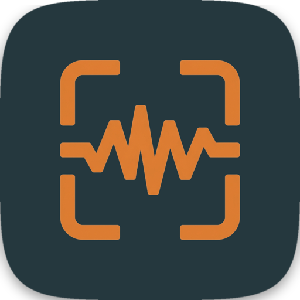

<p align="center">
  
</p>

<h1 align="center">Talkshot</h1>

<p align="center">
  Push-to-talk visual notes for macOS — screenshot what you're looking at, say what's wrong with it, and hand the whole thing to your AI coding assistant.
</p>

<p align="center">
  <a href="LICENSE"></a>
  
  
</p>

<p align="center">
  <a href="https://www.talkshot.work/"><strong>www.talkshot.work</strong></a>
</p>

---

## What it is

Talkshot lives in your menu bar. Hit one hotkey and it:

1. Takes a screenshot of your main display, with your cursor circled in red
2. Saves a cropped, zoomed-in shot of the area around your cursor
3. Starts recording your voice
4. Hit the hotkey again to stop — it transcribes what you said **entirely on-device** (Apple's Speech framework, nothing leaves your Mac)
5. Appends everything — screenshot, crop, cursor position, transcript — to a session folder on your Desktop

The result is a structured, timestamped log of exactly what you were looking at and exactly what you said about it — built to be pasted straight into Claude Code, Cursor, or any AI coding assistant as rich, unambiguous context. No more "the button on the left, no the other left, near the thing that's kind of blue."

## Why

Screenshots alone lose intent ("what's wrong with this?"). Voice notes alone lose visual context ("this thing, right here"). Talkshot captures both, tied together by a timestamp and a cursor position, so an AI assistant reading your session folder gets the same context a human looking over your shoulder would.

## Quick start

Install via Homebrew:

```bash
brew install --cask flowsxr/talkshot/talkshot
```

Or grab the notarized `.dmg` from [the latest release](https://github.com/flowsxr/talkshot/releases/latest).

Or build from source:

```bash
cd native && ./build.sh
```

This builds and launches Talkshot. On first run it'll ask for **Screen Recording**, **Microphone**, and **Accessibility** permissions — grant them once and you're set.

**Hotkeys:**

| Shortcut | Action |
|---|---|
| `Ctrl+Option+N` | Take a note (press again to stop recording) |
| `Ctrl+Option+E` | Finish session — saves, opens the folder, starts a fresh session |

Everything's also available from the menu bar icon if you'd rather click than remember shortcuts.

## Session output

```
~/Desktop/talkshot-session-20260704-132141/
├── shot_001.png      # full screen, red circle on cursor
├── crop_001.png      # zoomed region around cursor
├── notes.json        # structured entries (timestamp, cursor position, transcript)
└── notes.md          # human-readable version of the above
```

Each note is a self-contained record: when it was taken, where your cursor was (in both screen points and pixels), the full and cropped screenshots, and the transcribed text.

## Requirements

- macOS 14 (Sonoma) or later
- Xcode 15+ and [XcodeGen](https://github.com/yonaskolb/XcodeGen) (`brew install xcodegen`) to build from source

## Building for distribution

The default `./build.sh` produces a locally-signed build (fine for running on your own Mac). To build something you can hand to someone else:

```bash
cd native
./build-release.sh   # Developer ID signing, hardened runtime
./notarize.sh         # submits to Apple, staples the ticket, packages as a .dmg
```

This requires a paid Apple Developer Program membership and a `Developer ID Application` certificate (Xcode → Settings → Accounts → Manage Certificates). See [docs/KNOWN_ISSUES.md](docs/KNOWN_ISSUES.md) for the full signing/notarization story, including some non-obvious gotchas (ad-hoc signing invalidates permission grants on every rebuild; plain `xcodebuild build` silently injects a debug entitlement that gets your notarization submission rejected — you need the `archive` + `-exportArchive` pipeline instead).

## Python version

An earlier Python implementation ([`talkshot.py`](talkshot.py)) still works and is useful for quick scripting or if you want to swap in a different transcription model (e.g. `mlx-whisper`):

```bash
python3 -m pip install -r requirements.txt
python3 talkshot.py
```

Same hotkeys, same output format. The native Swift app is the recommended path going forward — proper macOS permission handling, a menu bar UI, and no Python environment to manage.

## Documentation

| Doc | Purpose |
|---|---|
| [AGENTS.md](AGENTS.md) | Start here if you're an AI agent working on this repo |
| [docs/ARCHITECTURE.md](docs/ARCHITECTURE.md) | System design, file map, data flow |
| [docs/SETUP.md](docs/SETUP.md) | Install, build, permissions in detail |
| [docs/KNOWN_ISSUES.md](docs/KNOWN_ISSUES.md) | Bugs, fixes, and the reasoning behind them |
| [native/README.md](native/README.md) | Native app specifics |

## Contributing

Issues and PRs welcome. If you're fixing a permissions/signing issue, `docs/KNOWN_ISSUES.md` has the debugging history — please add to it rather than rediscovering the same TCC quirks from scratch.

## License

[MIT](LICENSE) © FLOWXR PTE. LTD.
